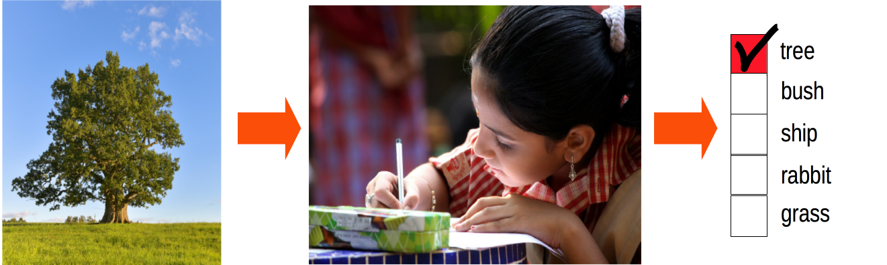
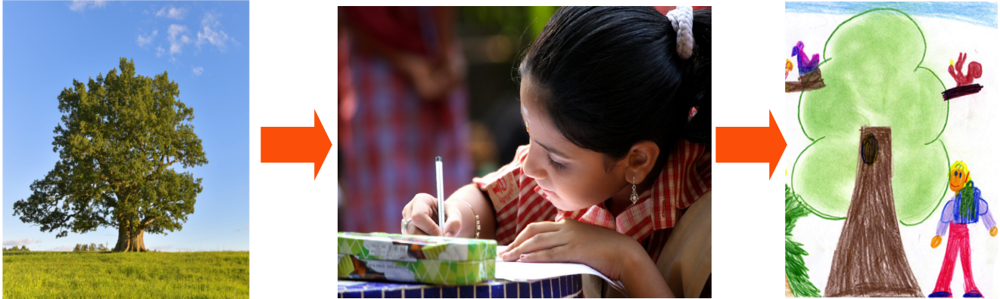

<h1>
<p align="center" fontsize=26>
Autoencoders
</p>
</h1>

 
<p align="center">
  
</p>

<p align="center" fontsize=26>
<font size="6">
<br>
Dmytro (Dima) Lituiev, PhD
</font>
</p>


<p align="center" fontsize=26>
<font size="5">
Practice Teach for the gU Faculty,<br>
Principal Data Scientist position
</font>
</p>

---
# Contents

 + Definitions & Motivation
 + Architecture & Learning
 	+ Compression of signal in autoencoders
 + Applications
 + Examples & Lab
 + [Advanced] Variational autoencoders

---

# [Review] Supervised vs Unsupervised tasks

---

## Classifier (supervised)
<p align="center">
  
</p>

 - given: features; task: predict target/label


## Autoencoder (unsupervised)
<p align="center">
  
</p>

 - only features, no label
 - learn some _structure_ from features


---
# AI $\leftrightarrow$ natural intelligence analogy
**Classifier**: a kid learning to name the objects (multiple choice)

<p align="center">
  
</p>

**Autoencoder**:  painting picture from memory; 
$\qquad$ $\qquad$ $\quad$ retelling a story by heart 


<p align="center">
  
</p>

---

# Why use autoencoders?

<p align="center">
  
</p>

 + compression / dimensionality reduction
 + pattern generation
 + noise reduction
 + anomaly detection (<- AE can return  probability of the data)
 + representation / transfer / semisupervised learning
 
---
# Representation learning

<p align="center">
  
</p>

_... is learning representations of the data that make it easier to extract useful information when building classifiers or other predictors_ ([Bengio 2014](https://arxiv.org/abs/1206.5538)).

Representations are stored in **filters** [CNNs]  or **weights** [general]

+ **Transfer learning**:
_transfer  representations learned earlier to another task_
+ **Semi-supervised learning**: _transfer learned representations 
 from an unsupervised to a supervised task_

---

# Autoencoder architecture

<p align="center">
  
| encoder | ->
low dimensional hidden / latent representation ->
| decoder | ->
high dimensional reconstruction" width="40%" height="80%"/>
</p>

Autoencoders learn to approximate the **identity mapping** under some **constraint on hidden representation (encoding)**.
 + original $\;\;\qquad\qquad$ $x$
 + encoder $\;\;\qquad\qquad h(\cdot)$
 + encoding $\qquad\qquad z = h(x)$  $\qquad$ or "hidden/latent state"
 + decoder$\;\;\qquad\qquad g(\cdot)$ $\qquad\qquad\;\; g$ for _generator_
 + reconstruction $\;\qquad r = g(z)$
 + idenitity mapping$\quad \;\,r = g(h(x))\approx x$
 
---

# Autoencoder architecture
 
 + encoder $\;\;\;\qquad\qquad\qquad$   $h(\cdot)$
 + encoding $\;\;\qquad\qquad\qquad$      $z = g(x)$
 + decoder $\;\;\;\qquad\qquad\qquad$   $g(\cdot)$
 + reconstruction $\;\;\qquad\qquad$    $r = g(z)$
 + idenitity mapping $\;\;\quad\qquad$ $r = g(h(x))\approx x$
 + **reconstruction error** (forces the mapping to be $\approx$ identity):
   - i.e. MSE:  $\quad\qquad\qquad$ $L(r,x) = ||r - x||^2$
 + **constraint loss** (optional):
   + i.e. L1 norm for sparsity: $\;$ $C(z) = \sum |z_i|$
 + **total loss** = reconstruction error + constraint loss
+ minimize the loss by SGD or its modification


---

# Constraints on hidden representation

+ **structural**: 
  - fewer hidden states (nodes) than dimensionality of the input ("undercomplete representation")
  
+ **regularization** (penalty, soft constr.) -- contributes to the loss
  - regularization of state values (not parameters!) e.g.:
    - L1 norm, $\sum |z_i| \;$: sparsity (e.g. sparse AE)
    - L2 norm, $\sum z_i^2 \;$: (e.g. PCA)
   - penalization of derivatives $\partial z_i/ \partial x_j$ -> stability; 
     ( see [Goodfellow's book, ch14](http://www.deeplearningbook.org/contents/autoencoders.html).7 )

Constraints in AEs lead to the **compression** of data 

---

# Compression

  + getting a shorter description of data
  + types of compression
    - lossless compression
    - lossy compression ( <- autoencoders )
  + compression works by identifying statistical patterns
    - discrete case (text/symbolic sequence): 
    assign a shorter code to **most probable** symbols 
    and **combinations** thereof
    ( background reading: [Shannon coding](https://en.wikipedia.org/wiki/Shannon%E2%80%93Fano_coding) )
    - continuous, lossy compression (linear Gaussian  -> PCA):
      extract directions of **highest co-variation**
  + statistical patterns are the **joint distribution** of features

---

# Lossy compression with PCA

 + represent a collection of $d$-dimensional vectors by a collection of $m$-dimensional principal components:
   - **encoder**:  $\qquad$  $W_{1:m} \, \mathbf{x} \rightarrow \, \mathbf{s}_{1:m}$
  `loadings * input --> scores`
   - **decoder**: $\qquad$ $W_{1:m, 1:m}^T \, \mathbf{s}_{1:m} \rightarrow \mathbf{r} \approx \mathbf{x}$ 
   `inv(loadings) * scores --> reconstruction`
   -  _scores_ are the hidden representations
   -  _loadings_ are both encoder's and decoder's weights
 + so that $m<d$, thus lossy compression
 + and reconstruction error is minimal:   $\mathrm{MSE} = ||\mathbf{r} - \mathbf{x}||^2$
 + constraint on loadings (not scores as in general AEs): $||\mathrm{w}_i||^2 =1$
 + variance of $\mathbf{s}_{i} >$  variance of $\mathbf{s}_{i+1}$

---

# [Summary] Architecture and Learning 


 + **Architecture**: auto-encoders have two parts:
   - **encoder** compresses a multi-dimensional observed data sample to a (low-dimensional or otherwise constrained) hidden representation of a sample
   - **decoder** unpacks / interprets / decompresses the low-dimensional hidden / latent representation into the _reconstruction_ of a sample
 
 + autoencoders learn to approximate the **identity mapping** under some **constraint on hidden representation**.
 
 + **reconstruction error** takes the end output of both parts of the network, while **constraint** takes the encoder output only
 
 + by learning encoding and decoding, the model learns the internal **dependencies between features** in the real-world data and thus the way to **compress** the data.

---

<h1>
<p align="center" fontsize=26>
Questions?
</p>
</h1>

<p align="center">
  
| encoder | ->
low dimensional hidden / latent representation ->
| decoder | ->
high dimensional reconstruction" width="50%" height="50%"/>
</p>

---

# Applications of Autoencoders

 + network pre-training / semi-supervised learning
 + generation of new patterns
 + noise reduction
 + anomaly detection 
   - autoencoders can return the probability of the data
 + data compression / dimensionality reduction
   - semantic hashing: dim. reduction w/ discretization
   
---

# [Applications] Semi-supervised learning

<p align="center">
  
</p>

Learning weights on unlabeled data improves classification performance in a smaller labeled dataset ([Erhan et al., 2010](http://www.jmlr.org/papers/volume11/erhan10a/erhan10a.pdf)).
On MNIST, using CNN

---

# [Applications] Pattern generation


<p align="center">
  
</p>

source: [Stitchfix Blog](
http://multithreaded.stitchfix.com/assets/images/blog/random_shirts3.png)

**Practical caviat**: Generative adversarial networks (GANs, next lecture) usually produce sharper and more realistic reconstructions of natural images than AEs

---

# [Applications] Noise reduction

<p align="center">
  
</p>

source: [Keras tutorial on Autoencoders](
https://blog.keras.io/building-autoencoders-in-keras.html)

---

# Related architectures

## Fully conv. networks 

Task: **image segmentation** (supervised learning)

<p align="center">

<div id="images">
  
  
</div>
<p align="center" fontsize=26>
<font size="4">
<a href=https://arxiv.org/pdf/1605.06211.pdf>
Shelhamer, Long, and Darrell, 2016</a>
</font>
</p>
</p>

Unilike autoencoders, FCNs have skip connections between 
low-level feature maps and low-level reconstruction maps.

Conceptually similar to the _denoising task_. Only labels are deemed 'essential', rest is treated as 'noise'.


---

# [Summary] Autoencoders

 + consist of two parts: encoder and decoder
 + approximate the identity mapping under some constraints
 + the loss to be minimized has two components:
   - reconstruction loss  (pertains to the decoder)
   - constraint on hidden representation (-> encdr.; optional)
 + AEs are generative, unsupervised models 
   - require no labels; features serve as label to themselves
 + AEs learn joint distribution of features (interdependencies)
   - this comes with compression of the data
 + applications: transfer (semi-supervised) learning, denoising, pattern generation, anomaly detection

---

# Example
```python
from keras.layers import Input, Dense
from keras.models import Model
# 784 / 32 floats -> compression of factor 24.5
input_dim = 784
encoding_dim = 32  

# this is our input placeholder
input_img = Input(shape=(input_dim,))
# the encoded / hidden representation of the input
hidden_repr = Dense(encoding_dim, 
		activation='sigmoid')(input_img)
# the lossy reconstruction of the input
reconstruction = Dense(input_dim,
		activation='sigmoid')(hidden_repr)

# this model maps an input to its reconstruction
autoencoder = Model(input_img, reconstruction)
autoencoder.compile(optimizer='adadelta',
		    loss='mse')
# ... prepare data: x_train ... 

autoencoder.fit(x_train, x_train, ...)
```

---

# Lab

**Source**:  https://github.com/DSLituiev/teaching -> [autoencoders/lab](https://github.com/DSLituiev/teaching/tree/master/autoencoders/lab) ;  **Reference**: [Keras tutorial on Autoencoders](
https://blog.keras.io/building-autoencoders-in-keras.html)

## Tasks and questions:
 + turn the network into a PCA model
   - compare to the results of `sklearn.decomposition` PCA
   - compare the results and training curves to an autoencoder of the same capacity (i.e. # of parameters)
 + turn the network into a sparse coder by applying L1 norm
 + In which case would you use Bernoulli distribution instead of Gaussian? Or L1 error? What do they assume?
 + Why neural net autoencoders are more expressive than PCA? Which PCA assumptions are dropped?
 +  How does CNN decoder maps a smaller image into a bigger?

---
# Architecture

<p align="center">
  
| encoder | ->
low dimensional hidden / latent representation ->
| decoder | ->
high dimensional reconstruction" width="80%" height="80%"/>
</p>

---
# Architecture: Variational Autoencoders

Autoencoders with probabilistic flavor

<p align="center">
  
</p>

---

# [Review] Variational inference
- **goal**: find a model distribution `Q(observed)` that approximates the real-world distribution of data `P(observed)` 
- **given**: observed samples drawn from real-world distribution `P(observed)`, family of `Q(h|o)` model functions
- **general approach**: maximize marginal _model_ probability distribution of observations `Q(o)`
- **challenge**: direct optimization of marginal model PDF/PMF is intractable
- **specific approach**: minimize _variational lower bound_ on difference between the real and model PDFs/PMFs
- **specific task**: approximate an unknown *real-world* posterior probability distribution `P(hidden|observed)` of an arbitrary shape using a parametrized *model* distribution `Q(hidden|observed)` while minimizing $\mathrm{KL}[Q(\mathbf{z}|\mathbf{x}) | \mathrm{P}(\mathbf{z})]$

---
# Variational Autoencoders (VAE)

Autoencoders with probabilistic flavor

<p align="center">
  
</p>

---

## Stochastic Gradient Variational Bayes (SGVB)

- Encode an original vector into a set of vectors representing moments of PDF  $Q_\phi(\mathbf{z}|\mathbf{x})$, namely mean and variance of $\mathbf{z}$.
- Sample hidden states $\mathbf{z} \sim Q_\phi(\mathbf{z}|\mathbf{x})$ using reparametrization:
 $z_i = \mu^{(z)}_i(\mathbf{x}) + \sigma^{(z)}_i(\mathbf{x})  \odot \epsilon \qquad \mathrm{where:}   \quad \epsilon \sim \mathcal{N}(0,1)$ 
- Take $\mathrm{KL}[Q_\phi(\mathbf{z}|\mathbf{x}) | \mathrm{Prior}(\mathbf{z})]$ as a **constraint loss**
- Decode the hidden states into the first moment of $P_\theta(\mathbf{x}|\mathbf{z})$, i.e. predicted mean of observed pixels
- Calculate the probability of the observation given the hidden state as a probabilistic **reconstruction loss**
  -  $\log P_\theta(\mathbf{x}|\mathbf{z}) \propto \mathrm{MSE} = ||\mathbf{x} - \mu^{(x)}(\mathbf{z}, \theta)||^2$ 
+ Backpropagate the loss to update the parameters of 
 the encoder ($\phi$) and the decoder ($\theta$) 
  
---
# VAE Summary
+ Variational autoencoders make use of variational inference framework, its language, methods, and probabilistic reasoning.
+ Variational inference is used to compute the probability of observed data given hidden state sampled from a predefined distribution family.
+ VAE allow for explicitly defining the prior over the hidden states.
+ VAE are in focus of recent research


---

<h1>
<p align="center">
Questions?
</p>
</h1>

<p align="center">
  
</p>


---

# Additional Lab Resources

+ [Keras tutorial on Autoencoders](
https://blog.keras.io/building-autoencoders-in-keras.html)

+ [Autoencoders [keras]. Agustinus Kristiadi's Blog](
http://wiseodd.github.io/techblog/2016/12/03/autoencoders/)

+ [Convolutional Autoencoders in Tensorflow](
https://pgaleone.eu/neural-networks/deep-learning/2016/12/13/convolutional-autoencoders-in-tensorflow/)

+ [Gumbel Max trick for categorical variables in VAE (in TF)](
http://blog.evjang.com/2016/11/tutorial-categorical-variational.html)

---
# Be able to explain these concepts!

+ autoencoder, encoder, decoder $\approx$ generator
+ compression and its relation to learning joint distribution
+ representation, transfer, semi-supervised learning
+ manifold learning [not covered here; see [Goodfellow's book](http://www.deeplearningbook.org/contents/autoencoders.html)]
+ hidden/latent representation
+ undercomplete, complete and overcomplete representation
 [see [Goodfellow's book](http://www.deeplearningbook.org/contents/autoencoders.html)]
+ constraint on hidden representation; sparsity constraint (L1)
+ reconstruction and reconstruction loss
+ relation of PCA to autoencoders
+ variational inference
+ variational autoencoder

_ask your peers or me if in doubt!_

---

# Reading

+ [[book chapter] Deep Learning. Chapter 14.
I.Goodfellow, Y.Bengio, and A.Courville ](http://www.deeplearningbook.org/contents/autoencoders.html)

+ [OpenAI blog](
https://openai.com/blog/generative-models/#vae)

+ [VAE combined with GANs](http://torch.ch/blog/2015/11/13/gan.html)

---

# Research

 + Why Does Unsupervised Pre-training Help Deep Learning? Erhan et al., 2010. [Journal of Machine Learning Research 11](http://www.jmlr.org/papers/volume11/erhan10a/erhan10a.pdf)
 
 + Auto-encoding variational Bayes. [Kingma & Welling 2013](https://arxiv.org/abs/1312.6114)

 + DRAW: A Recurrent Neural Network For Image Generation. [Gregor et al., 2015](https://arxiv.org/pdf/1502.04623.pdf)

 + Attend, Infer, Repeat: Fast Scene Understanding with Generative Models. [Ali Eslami et al., 2016](https://arxiv.org/abs/1603.08575)
    
 + Importance Weighted Autoencoders. [Burda et al., 2015.](
 	https://arxiv.org/pdf/1509.00519.pdf)
    
    
 + Fully Convolutional Networks for Semantic Segmentation.
[Shelhamer, Long, and Darrell, 2016](
https://arxiv.org/pdf/1605.06211.pdf)
