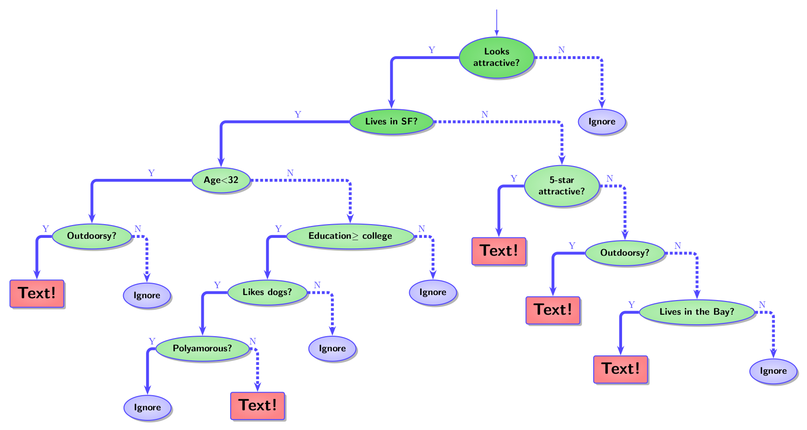
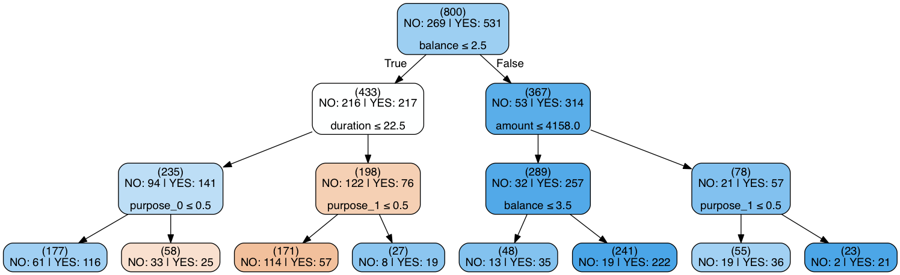

<h1>

Decision trees

</h1>

 
Practice teach @ General Assembly
Dmytro (Dima) Lituiev

---

# Learning objectives

---

# Plan

+ What is a decision tree applied to classification?
+ How prediction works with DT? 

+ Training a decision tree
+ Visualizing decision trees
+ Application domain

https://pollev.com/login

---

# Bob and Alice on dating app

  

---

# Terminology related to Decision Trees

+ **Attribute** is same as _feature_, _independent_/_exogenous_ var., X 
+ **Root Node** represents entire data set, which further gets divided into two or more homogeneous sets.
+ **Splitting**: dividing a node into two or more sub-nodes.
+ **Decision vs. Terminal node**: When a sub-node splits into further sub-nodes, then it is called **decision node**; otherwise it is called **Leaf or Terminal node**.
+ **Pruning**: removing sub-nodes of a decision node. Opposite process of splitting.
+ **Branch / Sub-Tree**: A sub section of entire tree is called branch or sub-tree.
[Source](https://www.analyticsvidhya.com/blog/2016/04/complete-tutorial-tree-based-modeling-scratch-in-python/)

---
# Decision Trees for Classification

Classification expressed as a **set of rules**.

Given: a set of _features / attributes_
Predict: value of _outcome variable_

---
# Example: predict bank credit approval

creditability|savings|balance|duration|$|purpose
-|-|-|--|----|-
1|1|4|21|2241|2
1|3|1|24|2828|2
0|1|1|45|11816|9
0|5|1|24|1371|0
1|1|4|24|5103|3

---

# Visualization of the results 

### Decision Tree _per se_

  

---
# Visualization of the results 

### Decision Tree _per se_

  

|appr|savings|balance|duration|$|purpose|
|--|--|--|--|--|--|
|1|1|1|6|1872|2|

---

# Training

##### Initialization:
+ Assign all samples to the root node

##### Recursion:
+ check stopping creteria and stop if necessary
+ compute gain in precision due to split on each feature
+ subdivide the node by the feature that maximizes precision

#### Stopping creteria:
+ All samples within node belong to the same class
+ No more attributes to be selected
+ Pre-set depth is reached 
+ Pre-set min number of examples per node reached

---

# Example in `sklearn`
see 

1. convert a `pandas` data frame to one-hot encoding

	features_onehot = pd.get_dummies(features)
    
2. create a classifier instance

	dtree = DecisionTreeClassifier(max_depth=3, 
    min_samples_leaf=20, criterion="gini")

3. fit

	dtree.fit(features_onehot, outcome)

4. visualize
5. predict

	dtree.predict(features_onehot_test)
    
---

### Step one: convert to one-hot encoding

---

# Pro and Contra

## Pro:

+ easy to interprete

## Contras and antidotes

+ easy to overfit / high variance
  - use an ensemble of trees

+ low expressivity: unable to handle feature co-dependencies

---

# Applications

---

---

# Learning resources

+ [Tutorial @analyticsvidhya](https://www.analyticsvidhya.com/blog/2016/04/complete-tutorial-tree-based-modeling-scratch-in-python/)
+ 