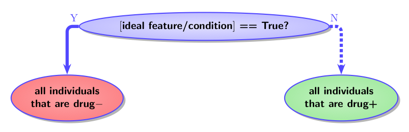
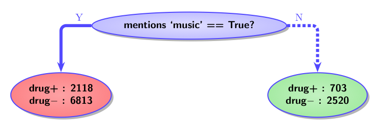
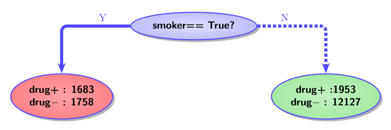
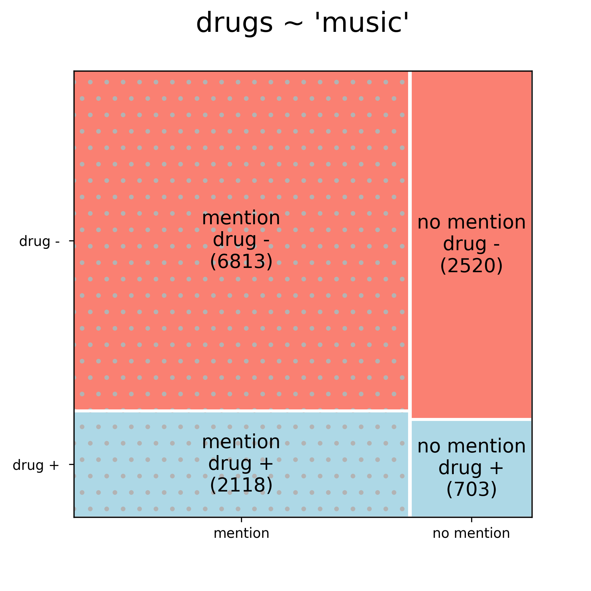
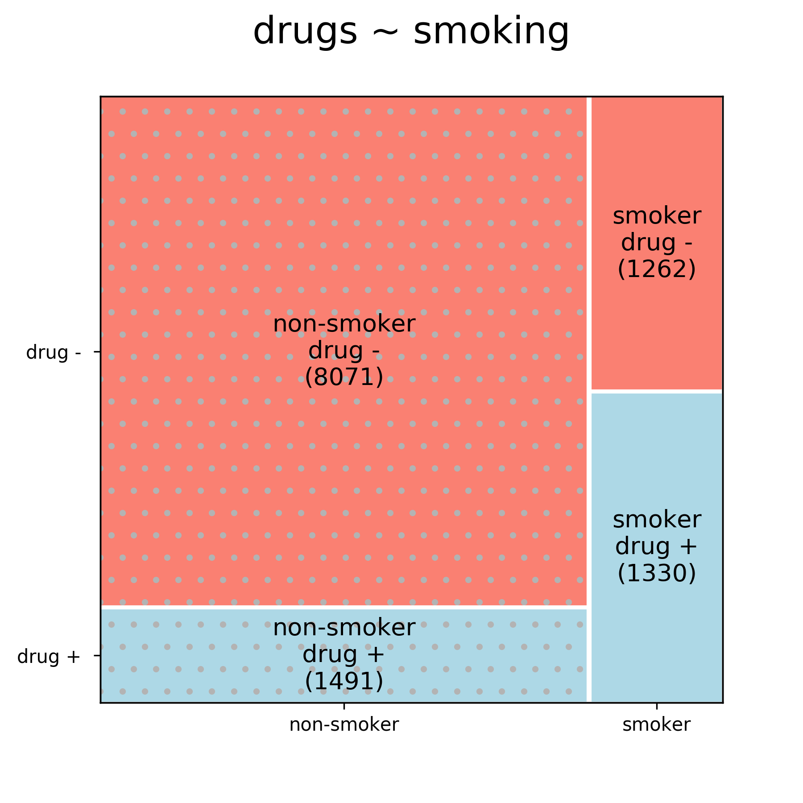
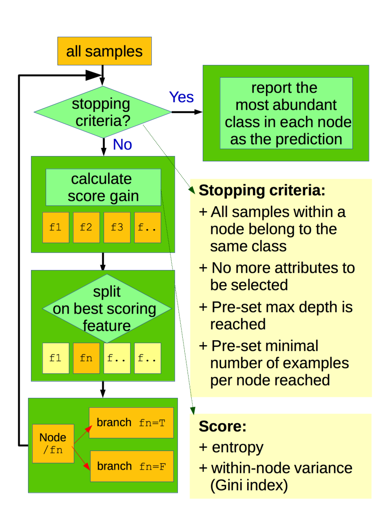
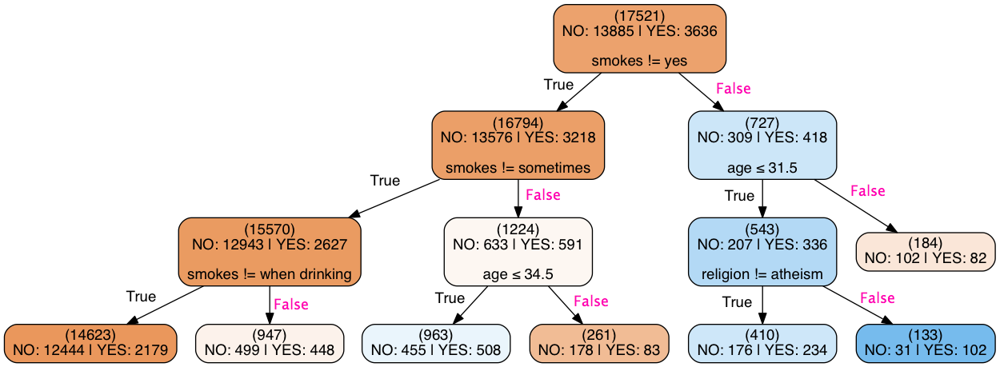

<h1>

Decision trees for classification

</h1>

 
Practice teach @ General Assembly
 
Dmytro (Dima) Lituiev
 

---

# Learning objectives
- be able to explain how classification is performed with decision trees (DTs)
- be able to build DTs
- be able to visualize DTs

---

# Plan

+ What is a DT as applied to classification?
+ How to do:
  - prediction?  
  - training?
  - visualization with DTs?
+ Why and when to use?
  - Advantages & disadvantages of DTs
  - Application domain
  
+ Lab: 
  - train, visualize and predict using a DT yourself!
---

# Predicting Bob's dating app behavior

|age|sex|religion|smokes|action|
| --| - | ------ | -----| -----|
|33|f|agnosticism|no|texted|
|23|f|atheism|yes|ignored|
|25|f|catholicism|no|texted|

### Task:
predict `action` from all other columns

### Approach: 
build a flowchart

---

# Predicting Bob's dating app behavior

  

### **apporach**:
represent classification **as if it were** a decision process guided by a flowchart (set of rules)

---
# Example: drug use in OKCupid data

_we will apply DT classification to predict drug use_:

age|sex|religion|"music"|smokes|drugs
---|---|--------| -------|----|---
33|m|agnosticism|True|no|never
43|m|agnosticism|False|no|sometimes
62|m|other|True|no|sometimes
22|f|catholicism|False|no|never
23|f|other|True|no|never

---
# Building a tree: (1) splitting a node

+ Take all data
+ Find **a feature** that partitions the set
  by **the  target** in the best possible way 

  
 

---
# Splitting a node

<h3>

Try all possible features:
 
 
Which split is better?

</h1>

 
 

<h3>

or

</h1>

 

---
# Splitting a node:  feature/target coocurrence in mosaic plot

 

  

 drug use is independent of mention of 'music', but is different between smokers and non-smokers

#### Paritioning quality metric / 'impurity score' : 
+ **entropy gain**:  $\qquad$ $H(p_y) - \sum_x p_x H_x(p_{yx}) =$
   $\qquad \qquad \;$  $= \sum_y p_{y} \cdot \log p_{y} - \sum_x p_x (\sum_y p_{y/x} \cdot \log p_{y/x})$
+ **Gini index**: covariance of feature & target

---

# Training

  

repeat node splitting recursively

---

# Quiz

https://pollev.com/DIMALITUIEV289

---

# Visualization of the results 

  

---
# Visualization of the results 

  

age|sex|religion|likes_cats|smokes|drugs
---|---|--------|----------|------|----
22|f|atheism|False|yes|?

_what is the expected drug status of this person?_

https://pollev.com/DIMALITUIEV289

---

# Pros and Cons

## Pros:

+ easy to interprete
+ requires little data normalization
+ handles both numerical and categorical data
+ easily handles multi-output problem

## Cons:

+ easy to overfit / high variance
  - especially with large number of features
  - antidote: an ensemble of trees

+ low expressivity: 
 unable to handle feature independence as in XOR, e.g.:
  (cat lovers & smokers)$\cup$(cat haters & non-smokers) $\rightarrow$ drug+

---

# Applications

+ both classification and regression
+ ML-assisted / informed decision making: 
  - medical decision-making
  - business analysis
  - policy-making
  - ...
  
+ as part of ensemble: more robust ML algorithms:
  - random forest
  - gradient boosting machines

---

# Example in `sklearn`
see [`sklearn` Decision Trees user guide](http://scikit-learn.org/stable/modules/tree.html#tree)

1. convert a `pandas` data frame to one-hot encoding

    features_onehot = pd.get_dummies(features)
    
2. create a classifier instance

    dtree = DecisionTreeClassifier(max_depth=3, 
    min_samples_leaf=20, criterion="gini")

3. fit

    dtree.fit(features_onehot, outcome)

4. visualize
5. predict

    dtree.predict(features_onehot_test)
    
---

# Lab

+ Predict drug use in the `validation` set 
  - Which preprocessing steps are required?
  - Calculate precision and recall

+ Increase `max_depth` to `5` and `7`
  - Visualize the obtained trees
  - How does performance in `validation` set change?
  - Which features appear in the tree nodes? which don't?
  
