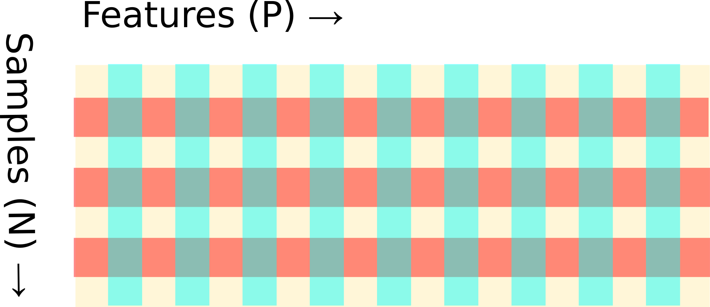

### https://github.com/DSLituiev/teaching

# Overfitting in Supervised Machine Learning

Generally speaking, overfitting can occur in any type of machine learning problem (supervised, un-supervised, reinforcement), but for simplicity we will go through an example with Supervised ML. 

## Supervised ML 
A supervised ML problem can be formulated as following (see [Y. Abu-Mostafa's lectures for greater detail](https://www.youtube.com/playlist?list=PLD63A284B7615313A) ):

### Supervised ML framework
#### Given
... unknown real-world function + probabilistic model for the error term:

$$f: X \rightarrow y$$

    predictors (independent variables) 
    target (outcome variable)
    
Or conditional distribution: $P(y|X)$

#### Learn 
... a model function based on a train dataset:

$$g: X_D \rightarrow \hat{y}_D$$

... that is able to predict target data so that

$$\hat{y}_D \approx{y}_D $$

    predictors 
    ->
    prediction
    
### Two basic procedures: 

+ **Learn** an approximation function $g \approx f$ that maps predictors $X$ to the target $y$ by:
  * selecting best model
  * inferring best parameters
+ **Predict** outcome variable on the validation set

### Learning can be formulated in several synonimous ways:

+ minimize _distance_ between predicted and observed target
+ maximize _accuracy_ of the prediction
+ maximize _likelihood_ of the parameters with given data

In any of the above cases, there must be a probabilistic assumption about how data is generated or in other words about probability distribution of the prediction error

### Two regimes :
+ **train** : learn & predict
+ **test/validation**: predict

### Two performance metrics of prediction:
+ train error
+ validation error
Error: how _far off_ is predicted target $\hat{y}$ from the observed target $y$

## Overfitting: 
+ low train error
+ high validation error


## Examples of overfitting

### Example 1: more predictors than samples ($N < P$)
#### Sometimes several models (or infinite set of parameters) explain data equally good
#### Which model do we pick in hope that it will predict unseen data best? 
#### ...


```python
X = np.array([[0,1,0], [0,0,1], [1,0,0], [1,1,1]]).T
y = np.c_[3,4,5]
X
```


    array([[0, 0, 1, 1],
           [1, 0, 0, 1],
           [0, 1, 0, 1]])


```python
print("""this is a solution:""")
beta = np.r_[2,3,1,2] 
X.dot(beta)
```

    this is a solution:


    array([3, 4, 5])


```python
print("""... and this is a solution as well:""")
beta = np.r_[3,4,2,1]
X.dot(beta)
```

    ... and this is a solution as well:


    array([3, 4, 5])


[extended material]()

#### Sometimes several models (or infinite set of parameters) explain data equally best
#### Which model do we pick in hope that it will predict unseen data best? 
#### Use Occam's razor!
+ pick the _simplest_ model possible
+ there can be different meaning to _simplest_:
  * L1 / lasso
  * L2 / ridge, Tikhonov regularization
  * L1 + L2 / elastic net
  * max-norm

### [Example 2 (extended): Different number of predictors in linear model](participants_synthetic_set.ipynb)

OK, so now we saw that overfitting happens when the model is too expressive (has more degrees of freedom) for the given data set size. To overcome overfitting we do _regularization_.

## Regularization is set of techniques to reduce over-fitting
### Two types of regularization

+ Weight penalization / decay
+ Stochastic penalization (Drop-out)

### Regularization works by forcing a model to be simpler in a sense

## [step back] What is error / loss / distance between prediction and observation
+ For continuous cases, most times it is L2 norm = mean squared error
    * this assumes normal distribution of noise
    
+ For discrete cases it is mis-classification rate

+ In general, both cases are dealing with a quantity proportional:
    * negative log-likelihood 
    * cross-entropy
    * KL divergence


```python

```

$$y = \sum_k b_j \cdot x_j $$

###  Consider under-determined system of equations 
($N < P$), more independent variables than equations

There will be more than one solution!




```python

```


```python

```

## Linear algebra: 

$N = P$ and $N<P$ cases

$$y_n = \sum_k b_j \cdot x_{jn} + \epsilon_n $$

OLS solution:
$$ \mathbf{\hat{\beta}} = (X'X)^{-1} X' \mathbf{y} $$

### Definition: 

Set of _linearly independent_ vectors is a set, where none of the elements can be expressed as a linear combination of any vectors from this subset.

Given vectors $\mathbf{x}_1, \mathbf{x}_2, \ldots \mathbf{x}_P$, there is no vector $\mathbf{x}_j$ that can be composed as 
    $$\mathbf{x}_p = \sum_{j=1}^{J<P} \mathbf{x}_j$$

### Theorem:

In a set of vectors of dimensionality $P$, there can be at most $P$ linearly independent vectors.

## Applied to linear regression:


Therefore in $ N \times P $ matrix, there will be at most $P$ linearly independent vectors.

Say we want to predict in $N<P$ task

To 


```python

```

### From linear algebra perspective:

the system of equations is sloppy, it admits multiple solutions

## From probabilistic / machine learning point of view:
Multiple model are able to produce the same result. Which model will you believe more?

## Deep models
Example of CNN for MNIST in Keras: 2 convolutional layers with 32 filters 3x3 and 128 fully connected layers, pool 2x2.

    input 28*28 = 784
    filters: two conv layers, each 32*(3*3+1) = 320

    dense: 4608 * 128 = 589824 weights

    Total: 590'464 weights

Almost 600'000 parameters

Train set: 60'000 samples

### Drop-out in linear regression as a penalty factor:

$$\hat{\mathbf{w}} = \mathrm{argmin}_\mathbf{w} \mathrm{logloss} $$

$$ \mathrm{logloss} = \mathbb{E}_{R\sim\mathrm{Bernoulli}(p)}
\left[ \left\lVert \mathbf{y} - (R \odot X) \mathbf{w} \right\rVert^2 \right] $$

$$\mathrm{logloss} = \mathbb{E}_{R_j^i\sim\mathrm{Bernoulli}(p)}
\left[ \left\lVert y^i - R_j^i \cdot X_j^i \cdot w^j \right\rVert^2 \right] $$


Taking the expectation:

$$\mathrm{logloss} = 
\left\lVert y^i - p \cdot X_j^i \cdot w^j \right\rVert^2  +  p \, (1-p) \, w_j X^j_i  \cdot X^i_{\hat{j}} \cdot w^{\hat{j}} $$

$$\mathrm{logloss} = 
\left\lVert \mathbf{y} - p \cdot X \cdot \mathbf{w} \right\rVert^2  + 
p \, (1-p) \, \left\lVert  \Gamma \mathbf{w} \right\rVert^2 $$

where $\Gamma = (\mathrm{diag}(X^T X))^{1/2}$

#### Thus drop-out can be seen as a stochastic penalization technique

#### Some hints for the derivation:
Bernoulli distribution 
$$P(x|p) = p^x \cdot p^{1-x}$$
$$\mathbb{E}(x) = p $$
$$\mathbb{E}(x^2) = p $$
$$\mathbb{E}(x_i\cdot x_j) = p^2 $$


$$\mathbb{E}(x_i^{\hat{j}}\cdot x_j^i) 
= (1-\delta_j^{\hat{j}}) \cdot p + \delta_j^{\hat{j}} \cdot p^2
= p + (p^2 - p) \cdot \delta_j^{\hat{j}}
$$


[see Srivastava et al., 2014](https://www.cs.toronto.edu/~hinton/absps/JMLRdropout.pdf)


```python

```

## Out-of sample prediction error
how far off is this particular model from real data


## Average model
a model of given kind (i.e. with fixed architecture and hyperparameters) trained on all possible sets of data drawn from real world (it is an abstract notion!)

## Bias:
how far off is an average model of this kind from the real data


## Variance 
how far is this particular model off from an average model of this kind

[see](https://work.caltech.edu/library/080.pdf)

## Analogies

Imagine a regular mattress --> low variance

Imagine a mattress that perfectly fits your shape when you lie on your left side with your left knee and elbow bent --> high variance

## Probabilistic framework

Data is generated by a distribution $y \sim P(y|X)$
We seek an approximating probabilistic model $y \sim Q(y|X)$

### Possible formulations of _optimal_ predictive model

Same thing:

+ minimize Kullback–Leibler divergence by minimizing the cross-entropy:
$$\mathrm{KL}[ P || Q ] = \mathbb{E}_P \log\left(\frac{P}{Q} \right) = H(P,Q)  - H(P) $$
$$H(P,Q) = -\mathbb{E}_P \log(Q) $$

+ maximum likelihood:

    maximize likelihood of the parameters $\theta$ of the model $Q(y|x, \theta)$ given observed $\{x,y\}$ points drawn from the real-world distribution $P(y|x)$
    
$$\mathrm{argmin}_\theta \mathbb{E}_{P(y|x)} \log Q(y|x, \theta) $$

+ minimize loss


# Example: number of parameters in non-linear models

$$y = \sum_k b_k \cdot f_k(x) $$

$$y = \sum_k b_k \cdot x^k $$


```python

```


```python

```


```python
N = 80
P = 5
# num_actual_predictors = 7
# y = np.random.randint(10, size=(N))
# betas = np.zeros(P)
# betas[np.random.randint(P, size = num_actual_predictors )] = 1.0
X = np.nan* np.ones((N,P))

X[:,0] = 2.0*np.random.randn(N,)

for pp in range(1, P-P//2):
    X[:,pp] = X[:,0]**pp
 
for pp in range( P-P//2, P):
    X[:,pp] = 1.0*np.random.randn(N,)

sigma = 1.2
noise = sigma*np.random.rand(N)
# y = X.dot(betas) + noise
y = np.cos(np.pi*2/3 +X[:,0]) + noise
# y = 0.05*X[:,0]**2 + noise
# y = np.cos(X[:,0]) + noise
# X.shape
```

## Note:
our predictive model does not match the ground truth

[as a rule, we cannot know how the data is generated in the real world](https://en.wikipedia.org/wiki/All_models_are_wrong)


```python
plt.scatter(X[:,0], y)
```


    <matplotlib.collections.PathCollection at 0x10e26b630>


```python
from sklearn.linear_model import ElasticNetCV, LassoCV, RidgeCV, LinearRegression

X_train, X_test, y_train, y_test = \
    train_test_split(X, y, test_size=0.25, random_state=3)
mo = {}

mo["lr"] = LinearRegression()
mo["lr"].fit(X_train, y_train,)
mo["lr"]

mo["elastic_net"] = ElasticNetCV(l1_ratio=0.5, cv=5)
mo["elastic_net"].fit(X_train, y_train,)
mo["elastic_net"]

mo["lasso"] = LassoCV(cv=5)
mo["lasso"].fit(X_train, y_train,)
mo["lasso"]

mo["ridge"] = RidgeCV(cv=5)
mo["ridge"].fit(X_train, y_train,)
mo["ridge"]
```


    RidgeCV(alphas=(0.1, 1.0, 10.0), cv=5, fit_intercept=True, gcv_mode=None,
        normalize=False, scoring=None, store_cv_values=False)


```python
print("R^2 in-sample:")
{kk: "%.4f" % vv.score(X_train, y_train ) for kk,vv in mo.items()}
```

    R^2 in-sample:


    {'elastic_net': '0.2308', 'lasso': '0.2313', 'lr': '0.2679', 'ridge': '0.2673'}


```python
print("R^2 of prediction:")
{kk: "%.4f" % vv.score(X_test, y_test ) for kk,vv in mo.items()}
```

    R^2 of prediction:


    {'elastic_net': '0.0382',
     'lasso': '0.0380',
     'lr': '-0.0513',
     'ridge': '-0.0194'}


```python
yhats = {}
colors = ['r', 'g', 'b', 'm', 'c']
fig, axs = plt.subplots(1,4, figsize=(16, 4))

plt.suptitle("Observed ~ Predicted")
for (kk,vv), ax,cc in zip(mo.items(), axs, colors):
# for (kk, vv), cc in zip(mo.items(), colors):
    yhats[kk] = vv.predict(X_test)
    print(kk, vv.score(X_test, y_test))
    order = np.argsort(yhats[kk])
    ax.scatter(X_test[:,0], y_test, c='k')
#     ax.plot(X_test[:,0][order], yhats[kk][order], label = kk, c = cc, lw=2)
    ax.scatter(X_test[:,0][order], yhats[kk][order], label = kk, c = cc, edgecolors='none')
#     ax.plot(yhats[kk][order], y_test[order], label = kk,c = cc)
    ax.set_title(kk)
```

    ridge -0.019437315484
    lr -0.0513318060095
    elastic_net 0.0382387654266
    lasso 0.0379982257847


```python
fig, axs = plt.subplots(4, figsize=(6, 16))

plt.title("Coefficients of the models")
for (kk,vv), ax in zip(mo.items(), axs):
    ax.stem(vv.coef_, markerfmt="ro", basefmt='k'+"-")
    ax.set_ylabel(kk)
    ax.set_xticklabels([])
    ax.set_xlim([-1, X.shape[1] ])
pass
```


